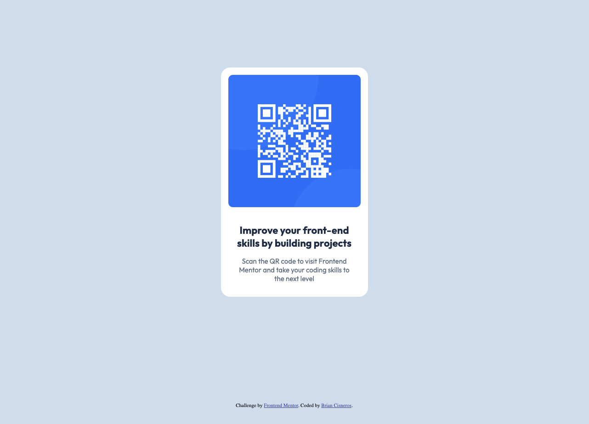

# Frontend Mentor - QR code component

This is a solution to the [QR code component challenge on Frontend Mentor](https://www.frontendmentor.io/challenges/qr-code-component-iux_sIO_H).

## Overview

This is a simple component that focuses on a card building experience. 
What makes this component stand out is its spacing and qr readability despite 
device size.

## Built With
- HTML
- CSS

## Author

- Frontend Mentor - [@cisneros1](https://www.frontendmentor.io/profile/cisneros1)
- X - [@brian947_](https://www.x.com/brian947_)

